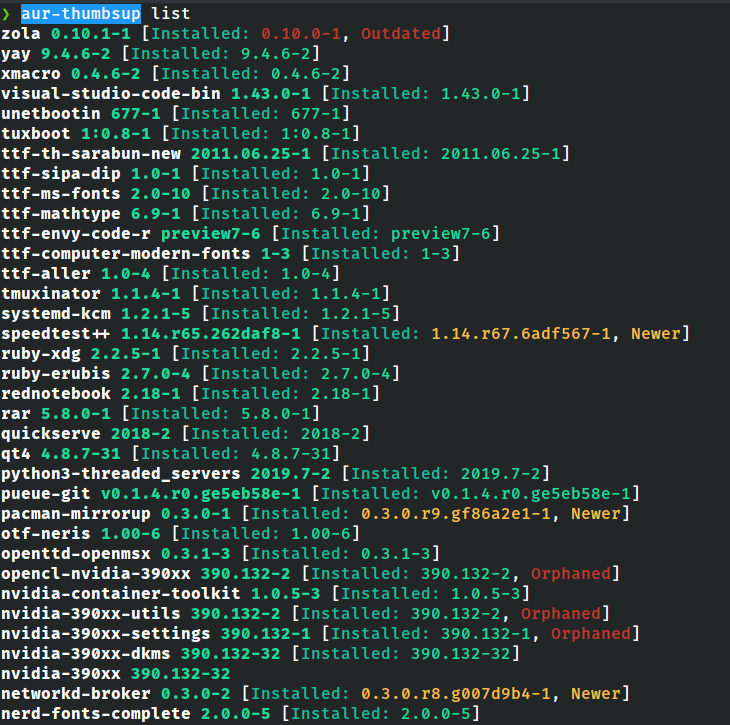
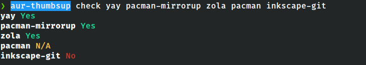
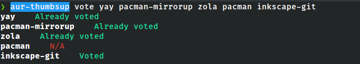

# AUR-Thumbsup 👍

[](https://github.com/bpetlert/aur-thumbsup/releases/latest)
[](https://aur.archlinux.org/packages/aur-thumbsup/)
[](./LICENSE)

A tool to manage voting for favorite AUR packages (including systemd
service for auto vote for installed packages)

## How Does Auto-Vote Works

`aur-thumbsup` will vote/unvote only for non-official installed
packages. It starts by querying all installed packages that do not exist
in official repositories (`core`, `extra`, `community`, and `multilib`)
and then filter out any packages that do not exist in AUR. Finally, vote
for any packages that not yet vote and unvote any packages that are not
installed anymore.

## Installation and Configuration

### Arch Linux

It is available on AUR as
[aur-thumbsup](https://aur.archlinux.org/packages/aur-thumbsup/). To
build and install arch package from GIT source:

``` sh
git clone https://github.com/bpetlert/aur-thumbsup.git
cd aur-thumbsup
makepkg -p PKGBUILD.local
pacman -U aur-thumbsup-xxxx-1-x86_64.pkg.tar
```

Setup user and password for aur-thumbsup service:

``` sh
$ aur-thumbsup create-config /etc/aur-thumbsup.toml
AUR user name:
Password:
Created `/etc/aur-thumbsup.toml`
```

Then enable/start aur-thumbsup.timer

``` sh
systemctl enable aur-thumbsup.timer
systemctl start aur-thumbsup.timer
```

To change the options of aur-thumbsup timer, run `systemctl edit
aur-thumbsup.timer`

``` ini
/etc/systemd/system/aur-thumbsup.timer.d/override.conf
-------------------------------------------------------------------------

[Timer]
OnCalendar=daily
```

## Use as Cli

To run aur-thumbsup as a user, it requires to create configuration file
for user. Use `aur-thumbsup create-config` to create default
configuration file: `~/.config/aur-thumbsup.toml`.

Common options are:

  - `-q`, `--quiet` Suppress stdout
  - `-c`, `--config <config>` Configuration file \[default:
    \~/.config/aur-thumbsup.toml\]
  - `-v`, `--verbose` Increment verbosity level once per call. Default
    is showing error.
      - `-v`: warn
      - `-vv`: info
      - `-vvv`: debug
      - `-vvvv`: trace

Support sub-commands are:

  - `autovote` Vote/Unvote for installed packages
  - `check` Check for voted packages
  - `check-config` Check configuration file
  - `create-config` Create configuration file
  - `list` List all voted packages
  - `unvote` Unvote packages
  - `unvote-all` Unvote for all installed packages
  - `vote` Vote for packages

### Example Usages

 


## License

**[MIT license](./LICENSE)**
